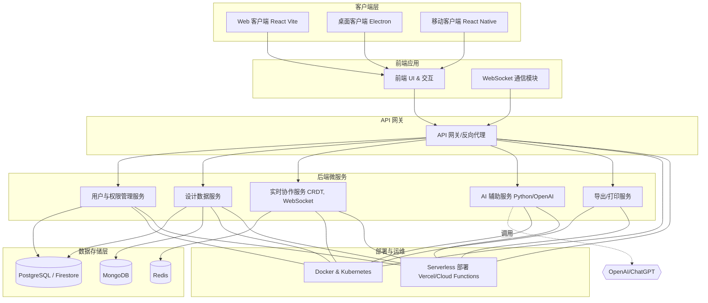

# **ison7 软件架构选型**

## **1. 软件架构设计**
### **架构模式**
- **前后端分离**（前端和后端通过 API 交互，提升扩展性）
- **微服务架构**（拆分不同服务，如存储、协作、AI 辅助）
- **Serverless**（低成本、弹性扩展需求）

---

## **2. 技术栈选型**
### **前端**
#### **选型方案**
1. **框架：Vite + React + TypeScript + Canvas**
    - 组件化开发，生态丰富，适合复杂交互
    - TypeScript 提高代码可维护性
    - Vite + React + Canvas（轻量、可定制）
    - 待定：[react-flow](https://reactflow.dev/)（轻量、可定制、支持拖拽）
3. **UI 组件库**
   - Tailwind CSS（轻量、可自定义）
   - Shadcn/ui（现代设计）

#### **关键技术**
- **Canvas / SVG 绘制思维导图**
- **WebSocket 实时协作**
- **拖拽 & 节点连接**
- **快捷键支持（Ctrl+Z 撤销，Ctrl+S 保存）**
- **Markdown / JSON 格式存储导出**

---

### **后端**
#### **选型方案**
1. **框架**
   - **Node.js**（轻量、适合前后端同构）
   - **后端待定**（高性能）
   - **Python**（适合 AI 辅助功能）
2. **实时协作**
   - 网络通信待定
   - 待定：CRDT（冲突自由数据类型）支持多人编辑
3. **AI 生成思维导图**
   - 待定：OpenAI / ChatGPT 接口
   - 自定义 NLP 解析文本生成结构化数据

---

### **数据库**
- **待定：PostgreSQL**（支持 JSON 数据存储）
- **待定：MongoDB**（更适合文档存储）
- **待定：Redis**（缓存 & 协作数据同步）
- **待定：Firebase Firestore**（Serverless 解决方案）

---

## **3. 部署方案**
- **待定：Docker + Kubernetes**（适合规模化应用）
- **待定：Serverless（Vercel / Cloud Functions）**（适合 MVP 快速上线）
- **待定：数据库托管（Supabase / Firebase）**（降低维护成本）

---

## **4. 关键功能**
✅ **图绘制**  
✅ **实时协作**  
✅ **AI 生成**  
✅ **跨平台支持（Web、桌面端 Electron、移动端 React Native）**  
✅ **云端存储 & 导出（JSON、Markdown、图片、PDF）**  
✅ **权限管理 & 共享**  

---

# ison7 软件设计方案及设计描述文档
# ison7 Level0 设计方案

## 一、概述
ison7 是一款基于 Web 的应用程序，旨在为用户提供类似 ComfyUI 的设计思维工具。该应用以 React Flow 的形式呈现，支持多种功能，如自定义节点、实时协作、AI 生成思维导图等。本设计方案将详细介绍软件的架构、技术选型、功能模块以及部署方案。

## 二、软件架构设计
### 2.1 架构模式
- 前后端分离 ：前端和后端通过 API 进行交互，这种模式可以提升系统的扩展性和可维护性。前端专注于用户界面和交互逻辑，后端负责处理业务逻辑和数据存储。
- 微服务架构 ：将不同的功能拆分成独立的微服务，如存储服务、协作服务、AI 辅助服务等。微服务架构可以提高系统的灵活性和可扩展性，便于团队并行开发和维护。
- Serverless ：采用 Serverless 架构可以降低成本，并且根据需求进行弹性扩展。Serverless 服务可以自动处理服务器的部署和管理，开发者只需关注业务逻辑。
### 2.2 技术栈选型 
#### 2.2.1 前端
- 框架 ：采用 Vite + React + TypeScript + Canvas 的组合。 React 是一个流行的 JavaScript 库，用于构建用户界面，支持组件化开发，生态丰富，适合复杂交互。 TypeScript 可以提高代码的可维护性和可读性。 Vite 是一个快速的构建工具，能够提供更快的开发体验。 Canvas 用于绘制思维导图和节点连接。同时，考虑使用 react-flow 来实现节点的拖拽和连接功能。
- UI 组件库 ：使用 Tailwind CSS 和 Shadcn/ui 。 Tailwind CSS 是一个轻量级的 CSS 框架，支持自定义样式。 Shadcn/ui 提供现代设计的 UI 组件。 
#### 2.2.2 后端
- 框架 ：选择 Node.js 作为后端框架，它轻量级且适合前后端同构开发。同时，考虑使用 Python 来实现 AI 辅助功能，因为 Python 在机器学习和自然语言处理领域有丰富的库和工具。
- 实时协作 ：网络通信方式待定，考虑使用 CRDT （冲突自由数据类型）来支持多人实时编辑，确保数据的一致性。
- AI 生成思维导图 ：待定使用 OpenAI / ChatGPT 接口，也可以开发自定义的 NLP 算法来解析文本并生成结构化数据。 
#### 2.2.3 数据库
- PostgreSQL ：支持 JSON 数据存储，适合存储节点配置和用户数据。
- MongoDB ：更适合文档存储，可用于存储思维导图的结构和历史记录。
- Redis ：用于缓存和协作数据同步，提高系统的性能和响应速度。
- Firebase Firestore ：作为 Serverless 解决方案，可降低数据库的维护成本。
### 2.3 部署方案
- Docker + Kubernetes ：适合规模化应用的部署，能够实现自动化的容器编排和管理。
- Serverless ：如 Vercel / Cloud Functions ，适合 MVP 快速上线，降低开发和部署成本。
- 数据库托管 ：如 Supabase / Firebase ，可以降低数据库的维护成本。

## 三、功能模块设计
### 3.1 基于白板的设计思维
- 自定义节点 ：用户可以自定义各类节点，节点的样式使用框架显示，节点内容包括大模型配置选项和参数配置。
- 节点连接 ：节点与节点之间使用线连接，线条的显示支持动画效果。
### 3.2 快捷键支持
支持常见的快捷键，如 Ctrl+Z 撤销操作， Ctrl+S 保存当前设计。

### 3.3 数据存储与导出
支持多种格式的存储和导出，包括 Markdown 、 JSON 、 PDF 、 图片 、 SVG 、 HTML 等。

### 3.4 AI 生成思维导图
通过调用 OpenAI / ChatGPT 接口或自定义 NLP 算法，根据用户输入的文本生成思维导图。

### 3.5 实时协作
支持多人实时协作编辑，使用 WebSocket 进行实时通信，确保数据的一致性。

### 3.6 跨平台支持
支持在 Web、桌面端（使用 Electron）和移动端（使用 React Native）上运行。

### 3.7 其他功能
- 权限管理 ：对不同用户角色设置不同的操作权限。
- 国际化 ：支持多种语言，方便不同地区的用户使用。
- 主题切换 ：提供多种主题供用户选择。
- 自定义样式 ：用户可以自定义节点和界面的样式。
- 自定义快捷键 ：用户可以根据自己的习惯设置快捷键。
- 缩略图显示 ：提供思维导图的缩略图，方便用户快速浏览。
- 历史记录 ：记录用户的操作历史，支持回滚和查看。
- 分享 ：用户可以将思维导图分享给他人。
- 导入导出 ：支持从外部文件导入思维导图，也可以将当前设计导出到文件。
- 打印 ：支持打印当前思维导图。
- 付费界面 ：提供免费使用和月付费、年付费、终生使用的选项。

## 四、设计描述文档
### 4.1 功能模块详细设计 
#### 4.1.1 基于白板的设计思维
- 节点管理 ：用户可以通过鼠标点击或快捷键创建、删除和编辑节点。节点的样式和内容可以通过配置文件进行自定义。
- 节点连接 ：用户可以通过鼠标拖拽的方式连接两个节点，系统会自动绘制连接线，并支持动画效果。 

#### 4.1.2 快捷键支持
- 撤销操作 ：按下 Ctrl+Z 键，系统会撤销上一步操作。
- 保存操作 ：按下 Ctrl+S 键，系统会保存当前设计到本地或数据库。 

#### 4.1.3 数据存储与导出
- 存储 ：系统会将用户的设计数据以 JSON 格式存储到数据库中，方便后续的查询和恢复。
- 导出 ：用户可以选择将当前设计导出为 Markdown 、 PDF 、 图片 、 SVG 、 HTML 等格式。 

#### 4.1.4 AI 生成思维导图
- 用户输入 ：用户输入一段文本，系统会调用 OpenAI / ChatGPT 接口或自定义 NLP 算法进行解析。
- 生成思维导图 ：根据解析结果，系统会自动生成思维导图，并显示在白板上。 

#### 4.1.5 实时协作
- 用户连接 ：多个用户可以通过 WebSocket 连接到同一个设计项目。
- 数据同步 ：当一个用户对思维导图进行修改时，系统会实时将修改同步到其他用户的界面上。 

#### 4.1.6 跨平台支持
- Web 端 ：使用浏览器直接访问应用程序，无需安装额外的软件。
- 桌面端 ：使用 Electron 打包应用程序，支持在 Windows、Mac 和 Linux 系统上运行。
- 移动端 ：使用 React Native 开发移动应用，支持在 iOS 和 Android 系统上运行。

### 4.2 技术实现细节 
#### 4.2.1 前端实现
- 组件化开发 ：使用 React 组件化开发，将不同的功能模块封装成独立的组件，提高代码的可维护性和复用性。
- TypeScript 类型检查 ：使用 TypeScript 进行类型检查，确保代码的正确性和可维护性。
- Canvas 绘制 ：使用 Canvas API 绘制思维导图和节点连接，实现动画效果。
- WebSocket 通信 ：使用 WebSocket 实现实时协作功能，确保数据的实时同步。 

#### 4.2.2 后端实现
- Node.js 服务 ：使用 Node.js 搭建后端服务，处理前端的请求和业务逻辑。
- Python 脚本 ：使用 Python 脚本实现 AI 辅助功能，如 NLP 解析和思维导图生成。
- 数据库操作 ：使用相应的数据库驱动程序与数据库进行交互，实现数据的存储和查询。 

#### 4.2.3 数据库设计
- PostgreSQL ：设计表结构，存储用户信息、节点配置和思维导图数据。
- MongoDB ：存储思维导图的结构和历史记录，方便后续的查询和分析。
- Redis ：使用 Redis 作为缓存和协作数据同步的工具，提高系统的性能和响应速度。
- Firebase Firestore ：使用 Firebase Firestore 作为 Serverless 数据库，降低数据库的维护成本。

## 五、总结
本设计方案详细介绍了 ison7 软件的架构、技术选型、功能模块以及部署方案。通过采用前后端分离、微服务架构和 Serverless 技术，提高了系统的扩展性和可维护性。同时，支持多种功能和跨平台使用，为用户提供了一个便捷的设计思维工具。
